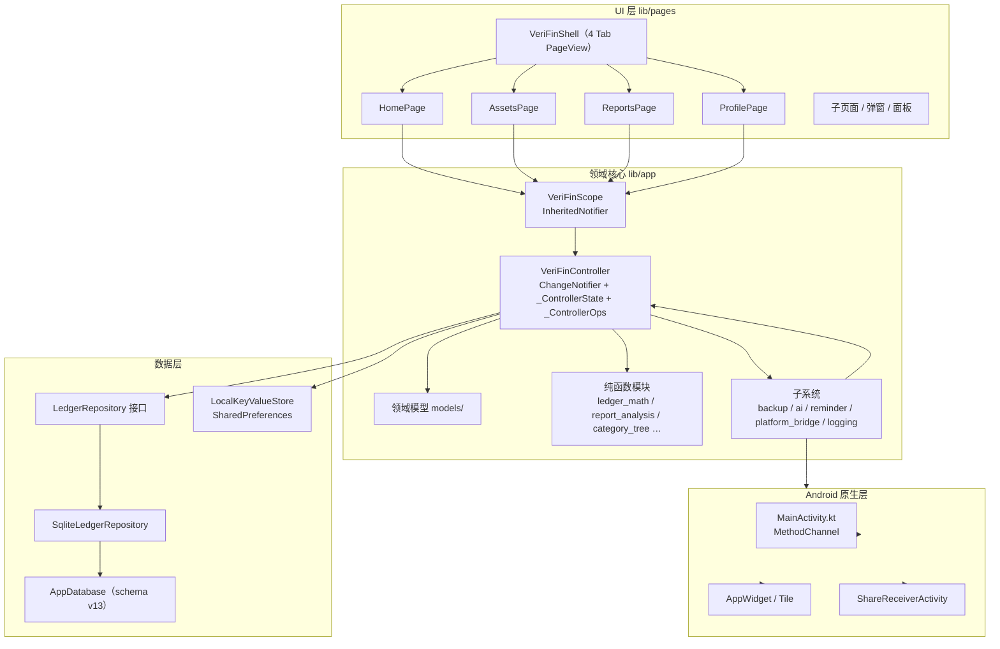

# Veri Fin 整体框架

> 本文档基于对 `lib/` 源码的通读整理而成，用于快速理解项目整体架构。框架文档按主题拆分，入口如下：
>
> - [architecture.md](architecture.md) —— 分层架构、启动流程、状态管理与数据流
> - [domain-models.md](domain-models.md) —— 领域模型与核心业务计算
> - [data-layer.md](data-layer.md) —— SQLite 数据层与 KV 偏好存储
> - [ui-layer.md](ui-layer.md) —— 页面层、导航、面板系统与通用组件
> - [subsystems.md](subsystems.md) —— 备份、导入、AI、OCR、提醒、平台桥接等子系统
> - [testing.md](testing.md) —— 测试体系

## 项目概况

Veri Fin 是一款 **完全免费、数据自主、本地优先** 的 Android 记账应用：

- 技术栈：Flutter 3 / Dart 3（仅 Android 交付），包名 `top.talyra42.verifin`，当前版本 `v1.11.5+89`
- 数据：全部保存在本地 —— SQLite（账目类数据）+ SharedPreferences（偏好类 KV），无服务器、无账号、无第三方统计 SDK
- 许可：GPL-3.0-or-later

## 代码规模

| 统计项 | 数量 |
| --- | --- |
| `lib/` Dart 文件 | 164 |
| `lib/` 代码行数 | 约 5.2 万行 |
| `pages/` 页面文件 | 47 |
| `test/` 测试文件 | 78（约 1.5 万行） |
| SQLite schema 版本 | v13（v2 ~ v13 共 12 个迁移段） |

## 技术选型一览

| 领域 | 方案 |
| --- | --- |
| 框架 | Flutter 3 / Dart 3 |
| 状态管理 | 单一 `ChangeNotifier` Controller + `InheritedNotifier` 注入，无第三方状态库 |
| 账目存储 | `sqflite`（含版本迁移） |
| 偏好存储 | `shared_preferences`（KV，经 `LocalKeyValueStore` 适配层） |
| 国际化 | Flutter 官方 gen-l10n（ARB，zh 模板 + en 同步） |
| 备份加密 | `cryptography` 纯 Dart：AES-GCM + PBKDF2-SHA256 |
| 备份打包 | `archive`：附件图片与 data.json 打 zip |
| 云备份 | `dart:io HttpClient` 手写 WebDAV 客户端（PUT/GET/PROPFIND/MKCOL） |
| 图表 | 全部 `CustomPainter` 自绘（趋势/柱状/环形，带命中测试与数据气泡） |
| 生物解锁 | `local_auth`（仅指纹） |
| 提醒 | `flutter_local_notifications` + `timezone`/`flutter_timezone` |
| 截图 OCR | `google_mlkit_text_recognition`（端侧离线，中文模型，图片不出设备） |
| AI | OpenAI 兼容 Chat Completions 接口，自带 baseUrl/API Key，纯 Dart HTTP + SSE |
| 附件 | `image_picker`（拍照/相册），压缩 JPEG 后以 data URL 存 SQLite |
| 平台能力 | MethodChannel 桥（SAF / 下载目录 / 分享采集 / 自更新 / 桌面小组件数据推送） |

## 顶层目录结构

```text
lib/
├── main.dart                # 应用入口与根组件（VeriFinApp / DatabaseErrorApp）
├── pages/                   # UI 页面层（47 个文件）
├── app/                     # 领域核心层
│   ├── veri_fin_controller.dart          # 控制器门面（+ state/ops 两个 part）
│   ├── veri_fin_controller_state.dart    # 内存状态 + KV/SQLite 装载与落盘
│   ├── veri_fin_controller_ops.dart      # 约 115 个领域操作
│   ├── veri_fin_scope.dart               # InheritedNotifier 注入
│   ├── models/               # 领域模型（account/category/ledger_book/ledger_entry/preferences/user_profile）
│   ├── ai/                   # AI 对话记账、AI 查询工具、聊天引擎
│   ├── backup/               # 备份、WebDAV、导入（import/）
│   ├── reminder/             # 记账提醒
│   ├── logging/              # 软件日志（AppLogger）
│   ├── platform_bridge*.dart # Android MethodChannel 桥
│   ├── common_widgets*.dart  # 通用组件体系
│   └── …（纯函数模块：ledger_math、report_analysis、category_tree、chart_painters 等）
├── data/                     # SQLite 数据层（AppDatabase + LedgerRepository）
├── local_storage/            # KV 存储适配（SharedPreferences / 测试 stub）
└── l10n/                     # ARB 与生成的 AppLocalizations

android/app/src/main/kotlin/top/talyra42/verifin/   # 原生层
test/                         # 测试（78 个 *_test.dart）
docs/                         # 产品与技术文档
```

## 架构总览



## 分层与依赖方向

```text
pages（UI）  ──依赖──►  app（Controller/模型/子系统）  ──依赖──►  data + local_storage（持久化）
                                                                      │
                                                     app 内部子系统再依赖 platform_bridge ──► Android 原生
```

核心约定（详见 `AGENTS.md`）：

1. **UI 不直接触碰 repository / KV**：页面一律通过 `VeriFinScope.of(context)` 取 Controller，持久化由 Controller 的 `_persist*` 完成。
2. **单一权威状态**：Controller 是唯一可变状态源，`notifyListeners()` 后重建派生视图缓存。
3. **平台差异用接口 + io/stub 双实现**：`database_factory`、`local_storage`、`attachment_picker`、`biometric_auth`、`backup_storage`、`webdav_client`、`screenshot_recognizer`、`notification_scheduler`、`ai_client` 均遵循此模式。
4. **账目数据以 SQLite 为准**，偏好类小数据留在 KV；备份 JSON 只包含账目类数据与展示偏好，密钥类（应用锁、备份口令、WebDAV 密码、AI Key）不进备份。

## 文档导航

| 想了解什么 | 去读 |
| --- | --- |
| 分层、启动流程、状态管理 | [architecture.md](architecture.md) |
| 记账/账户/预算/报表等模型 | [domain-models.md](domain-models.md) |
| SQLite 表结构、迁移、Repository | [data-layer.md](data-layer.md) |
| 页面清单、导航、面板、通用组件 | [ui-layer.md](ui-layer.md) |
| 备份/导入/AI/OCR/提醒/平台桥 | [subsystems.md](subsystems.md) |
| 测试组织与基建 | [testing.md](testing.md) |
