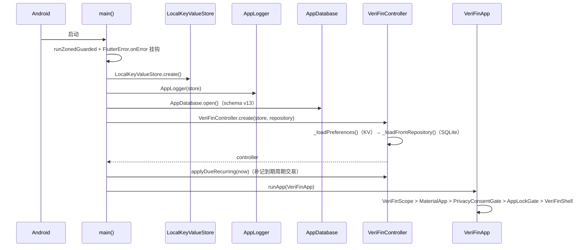

# 架构设计

## 1. 分层职责

### UI 层（`lib/pages/`）

- 纯 Flutter Widget，无业务状态（除页面级临时 UI 状态）。
- 通过 `VeriFinScope.of(context)` 读取 Controller；变更统一由 `InheritedNotifier` 通知重建。
- 弹窗统一走 `sheets.dart` / 顶层 `show*Sheet` helper，页面内禁止裸用 `showModalBottomSheet`。
- 金额/日期格式化、颜色、图表等一律复用 `app/` 下的统一入口，禁止内联手拼。

### 领域核心层（`lib/app/`）

- **Controller**：`VeriFinController` 是唯一权威状态源，拆成三个 part：
  - `veri_fin_controller.dart`：类门面、构造入口 `create()`、KV 键常量、备份数据键白名单、工具函数。
  - `veri_fin_controller_state.dart`：内存字段、KV/SQLite 装载与落盘（`_load*` / `_persist*`）、派生视图缓存失效。
  - `veri_fin_controller_ops.dart`：约 115 个领域操作（记账、账本、账户、分类、标签、预算、周期、退款、导入应用、面板等）。
- **领域模型**：`models/` 下不可变模型（`copyWith` / `toJson` / `fromJson`）。
- **纯函数模块**：`ledger_math`（记账数学/日期窗口）、`report_analysis`（报表分析）、`category_tree`（分类树）、`budget_cycle`（预算周期）、`calc_expression`（算式）、`calendar_days`（日历算术）、`series_math`（序列）等，均可脱离 UI 单测。
- **子系统**：备份/导入、AI、提醒、日志、平台桥接，见 [subsystems.md](subsystems.md)。

### 数据层（`lib/data/` + `lib/local_storage/`）

- `LedgerRepository` 接口 + `SqliteLedgerRepository` 实现（账目类数据）。
- `AppDatabase`：建表、schema v13、按版本迁移。
- `LocalKeyValueStore`：偏好 KV 的适配层（真实平台 SharedPreferences，测试为内存实现）。

### Android 原生层（`android/`）

- `MainActivity.kt`：MethodChannel 宿主，处理 SAF、下载目录、分享/快捷入口 Intent、自更新、小组件数据推送、FLAG_SECURE。
- `QuickEntryWidgetProvider` / `StatWidgetProvider` / `QuickEntryTileService`：桌面小组件与快捷设置磁贴。
- `ShareReceiverActivity`：接收分享给应用的截图/文本。

## 2. 启动流程

启动期关键点：

- 顶层 `runZonedGuarded` 兜底未捕获异常，`FlutterError.onError` 同时写软件日志。
- 数据库打开失败不删数据，渲染 `DatabaseErrorApp`（最小依赖自足页面），明确提示"数据很可能还在、别清数据"。
- `VeriFinController.create` 先同步读 KV 偏好，再异步从 SQLite 装载账目类数据；全新库会按系统语言写入默认种子（账本/分类/资料）。
- 根组件 `_VeriFinAppState` 注册生命周期观察者：回前台依次「补记周期 → 自动备份 → 推小组件 → 重排提醒」；切后台时 `flushPendingWrites()` 刷盘。

## 3. 状态管理模型

### 注入方式

`VeriFinScope extends InheritedNotifier<VeriFinController>`：

- 根组件用 `VeriFinScope(controller: _controller, child: ...)` 注入；
- 任意页面 `VeriFinScope.of(context)` 取得 Controller，并在其 `notifyListeners()` 时自动重建依赖的子树。

### 内存状态（`_ControllerState`）

账目类列表：

| 字段 | 说明 |
| --- | --- |
| `_entries` / `_ledgerBooks` / `_accounts` / `_accountGroups` / `_categories` / `_tags` | 核心账目数据，来自 SQLite |
| `_attachments` | 交易图片附件（data URL） |
| `_recurringRules` | 周期记账规则 |
| `_monthlyBudgets` / `_categoryBudgets` / `_dailyBudgets` | 月/分类/按日预算，key 按 `bookId:yyyy-MM[:catId]` 隔离 |

偏好/配置类字段（来自 KV）：

`_themePreference`、`_localePreference`、`_profile`、`_activeBookId`、`_assetCoverUrl`、`_hapticsEnabled`、`_privacyConsentAccepted`、`_onboardingCompleted`、`_appLockConfig`、`_assetAccountViewMode`、`_backupSettings`、`_backupPassphrase`、`_webdavConfig`、`_reminderSettings`、`_fabActionMode`、`_homeTrendConfig`、`_amountForceTwoDecimals`、`_autoSuggestEnabled`、`_aiSettings`、`_aiChatHistory`，以及资产排序/折叠、面板开关等。

### 派生视图缓存

`_entriesView` / `_accountsView` / `_accountGroupsView` / `_categoriesView` 是按当前账本过滤后的不可变列表缓存：

- `notifyListeners()` 是唯一失效点（先 `_invalidateDerivedViews()` 再通知）；
- UI 只读派生视图，内部逻辑始终读私有原列表；
- 新增派生字段必须同步加入 `_invalidateDerivedViews()`，否则只会拿到过期缓存（不报错）。

### 生命周期回调

| 回调 | 用途 | 挂载方 |
| --- | --- | --- |
| `onEntryAdded` | 记一笔后自动备份 + 推桌面小组件 | 根组件 |
| `onPersistError` | 落库失败弹「保存失败」SnackBar | 根组件 |
| `onAppLockChanged` | 应用锁开关变化时同步 FLAG_SECURE | 根组件 |
| `onReminderChanged` | 提醒配置变化时重排本地通知 | 根组件 |

## 4. 持久化策略

- **写路径**：领域操作 → `_persist*`（异步 `_trackWrite`）→ repository / KV；落库失败走 `onPersistError` 回调，由 UI 提示，不吞异常。
- **读路径**：`create()` 时 KV 先于 SQLite 装载；账目类数据只从 SQLite 读。
- **flush**：切后台（paused/hidden）时 `controller.flushPendingWrites()`，等待挂起写盘完成，缩小"刚改完被系统回收 → 丢失"窗口。
- **备份/恢复**：`exportDataJson()` 导出账目类快照，`importDataJson()` 恢复并自愈（见 [subsystems.md](subsystems.md)）。

## 5. 错误处理与日志约定

- `catch` 后必须二选一：写 `logger.error(msg, source: ..., error: e)` 并给用户可见反馈；或是有意降级并注释原因。禁止空 `catch (_) {}`。
- 生产日志只用 `lib/app/logging` 的 `AppLogger`（分级、上限 200 条、可导出、隐私友好），不用 `print` / `debugPrint`。
- 易错路径（backup / import / ai / webdav / 数据库）的 catch 必须写日志。

## 6. 关键工程约定

- 新写 widget/弹窗/格式化/计算前，先查 `docs/dev/components.md` 组件清单，命中即复用或加参数扩展，不复制脚手架。
- 金额只走 `formatAmount` / `formatSignedAmount` / `formatCompactAmount`；日期只走 l10n 的 `dateMonthDay` / `yearMonth`。
- 日期算术用 `calendarDaysBetween` / `addCalendarDays`，禁止裸用 `difference().inDays` / `add(Duration(days:))`。
- 颜色用 `veri*` 常量，圆角用 `veriRadius*`，主色 `#346EDB`（veriRoyal）。
- 分类/账户图标渲染唯一入口：`CategoryIconBox` / `CategoryGlyph` / `AccountIconBox`。
- 用户可见文案一律进 `lib/l10n/*.arb`，经 `AppLocalizations.of(context)` 引用（例外：法律正文、品牌名、CSV 模板表头等）。
